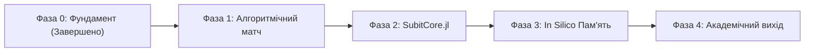

# 🗺️ Стратегічна дорожня карта: SUBIT-Connectome (2026–2027)

> **Місія проєкту:** Створити міст між великими емпіричними даними біологічних коннектомів (*MaleCNS*, *FlyWire*) та теоретичною архітектурою рекурсивного кодування **SUBIT-∞** для розв'язання фундаментальної проблеми субстратної інваріантності функціональної організації мозку.

---

## 🧭 Огляд фаз розвитку

---

## Фаза 0: Фундамент, класифікація та реструктуризація
**Статус:** 🟢 Завершено (Жовтень 2026)

- [x] **Реорганізація репозиторію:** Впровадження чистої модульної структури (`papers/`, `src/`, `data/`, `output/`, `viz/`, `vendor/`).
- [x] **Оцифрування MaleCNS у SUBIT-64:** Розробка конвеєра квантування нейронів за осями $WHO \times WHERE \times WHEN$ на мові Julia ([`src/SubitCore/classifier.jl`](src/SubitCore/classifier.jl)).
- [x] **Побудова мета-графа 64×64:** Агрегація синаптичних ваг та виявлення полярності системи:
  - Вхідний сенсорний полюс: стани $S0, S4$ (2,867 нейронів).
  - Релейні магістралі: стан $S25$ (1,161 нейрон).
  - Резонансні атрактори пам'яті: стани $S34, S38, S42$ (1,494 нейрони).
  - Моторний термінал: стани $S51, S63$ (2,402 нейрони, самопетля $S63 > 1.21$ млн).
- [x] **Інтерактивна візуалізація:** Створення автономного дашборду Generative UI ([`viz/subit_connectome_viz.html`](viz/subit_connectome_viz.html)).
- [x] **Теоретичний базис:** Сформульовано рукописи статей про субстратну інваріантність ([`papers/paper_concept.md`](papers/paper_concept.md)) та трофічну пам'ять ([`papers/paper_trophic_memory.md`](papers/paper_trophic_memory.md)).

---

## Фаза 1: Алгоритмічний прорив у граф-матчингу (VNC Challenge)
**Статус:** 🟡 В процесі / Пріоритет (Q4 2026 – Q1 2027)  
**Мета:** Перевершити існуючі бенчмарки вирівнювання чоловічого та жіночого коннектомів VNC, використовуючи координати SUBIT як просторово-функціональні обмеження.

- [ ] **1.1. SUBIT-Guided Search Space Reduction:**
  - Обмеження простору пошуку партнерів: під час жадібного пошуку шукати заміни лише в межах того самого або суміжного класу SUBIT-64.
  - Очікуваний ефект: прискорення сходження оптимізації у 10–30 разів без втрати точності.
- [ ] **1.2. Регуляризація матриці подібності (Cost Matrix):**
  - Побудова функції штрафу за невдовідність SUBIT-координат:
    $$\Delta C(i, j) = \| \mathbf{v}_{\mathrm{male}}(i) - \mathbf{v}_{\mathrm{female}}(j) \|_2 + \lambda \cdot \mathbb{I}(\mathrm{SUBIT}_i \neq \mathrm{SUBIT}_j)$$
- [ ] **1.3. Впровадження спектральних методів (Sinkhorn / Frank-Wolfe):**
  - Заміна наївного жадібного призначення на регулярний розв'язок задачі квадратичного призначення (QAP) на розріджених матрицях.
- [ ] **1.4. Подолання бенчмарку:**
  - Цільовий орієнтир: скор змагання $> 5,816,444$ (поточний рекорд команди CIBR).

---

## Фаза 2: Пакетна екосистема `SubitCore.jl` та морфологічний компілятор
**Термін:** Q1 – Q2 2027  
**Мета:** Створити самостійну, відкриту бібліотеку на Julia для рекурсивного моделювання та міжсубстратної трансляції складних мереж.

- [ ] **2.1. Формалізація типів даних (`SubitCore.jl`):**
  - Реалізація коіндуктивних структур даних $S_\infty = \nu X.(A \sqcup X^3)$ та представлення динамічних операторів $\rho$.
  - Абстракція станів системи: рівні SUBIT-64, SUBIT⁺, SUBIT-TOPOS.
- [ ] **2.2. Алгоритми рекурсивного стиснення (Coarse-Graining):**
  - Зведення 18.5k коннектома до 64-вузлового динамічного мета-графа зі збереженням фазових портретів та спектральних властивостей.
- [ ] **2.3. Транслятор у спайкові нейромережі (Spiking Translator):**
  - Автоматична генерація з коннектому коду симуляцій для спайкових рушіїв (*Brian2*, *NEST*, або власного легкового рушія на Julia).
  - Перевірка стійкості аттракторів при зміні фізичних параметрів мембран (початок тестування субстратної інваріантності).

---

## Фаза 3: *In Silico* моделювання трофічної пам'яті та скидання контексту
**Термін:** Q2 – Q3 2027  
**Мета:** Експериментальна чисельна перевірка гіпотез із статті про трофічну пам'ять рогів оленя ([`papers/paper_trophic_memory.md`](papers/paper_trophic_memory.md)).

- [ ] **3.1. Симуляційний стенд морфогенетичного росту:**
  - Створення 2D/3D моделі росту відростка (клітинний автомат або реакційно-дифузійна система Тюрінга).
  - Введення травми $H(\xi)$ під час росту з подальшим повним видаленням (скиданням) тканини.
- [ ] **3.2. Перевірка гіпотези «пам'ять стану проти пам'яті правил»:**
  - Моделювання двох контурів:
    * Пам'ять стану ($x_{t+1} = F(x_t)$) — структурний слід у базі (педикулі).
    * Пам'ять правил ($\theta_{t+1} = G(\theta_t)$) — зміна глобальних параметрів росту через біоелектричні петлі.
  - Програмний розрахунок умовної взаємної інформації:
    $$I(Y; H \mid x, c) > 0$$
- [ ] **3.3. Паралелі з LLM та ШІ-агентами:**
  - Порівняльний експеримент: збереження історично набутих диспозицій агента після очищення контекстного вікна через модифікацію архітектурної пам'яті.

---

## Фаза 4: Академічні публікації та відкритий бенчмарк
**Термін:** Q3 – Q4 2027  
**Мета:** Оприлюднення результатів у провідних наукових виданнях та залучення міжнародної спільноти.

- [ ] **4.1. Публікація статті 1 (Субстратна інваріантність):**
  - Доопрацювання рукопису [`papers/paper_concept.md`](papers/paper_concept.md) із додаванням реальних емпіричних розрахунків MaleCNS та мета-графа 64×64.
  - Цільові журнали: *BioSystems*, *Artificial Life*, *Cognitive Systems Research*.
- [ ] **4.2. Публікація статті 2 (Трофічна пам'ять):**
  - Фіналізація бібліографії та рецензування рукопису [`papers/paper_trophic_memory.md`](papers/paper_trophic_memory.md).
  - Цільові журнали: *Biological Theory*, *Frontiers in Systems Neuroscience*.
- [ ] **4.3. Реліз відкритого пакета `SUBIT-Connectome`:**
  - Публікація коду, документації та інтерактивного веб-атласу на GitHub.
  - Реєстрація Julia-пакета у General Registry.

---

## 📊 Ключові показники успіху (KPIs)

| Метрика | Поточний стан | Цільове значення | Фаза |
| :--- | :--- | :--- | :--- |
| **Скор вирівнювання VNC (VNC Matching Score)** | ~5.20M – 5.81M | **> 6.00M** | Фаза 1 |
| **Швидкість ітерації граф-матчингу** | ~100–300 ітерацій/хв | **> 2,000 ітерацій/хв** | Фаза 1 |
| **Рівень редукції розмірності коннектома** | 18,524 вузли | **64 макро-стани (100% покриття)** | Фаза 0-2 (Виконано) |
| **Збереження динамічних атракторів** | Якісний опис | **Кількісний збіг фазових траєкторій > 90%** | Фаза 2 |
| **Публікації у Scopus / WoS** | 2 рукописи в роботі | **2 прийняті статті** | Фаза 4 |
